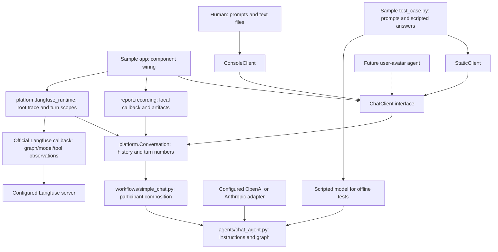
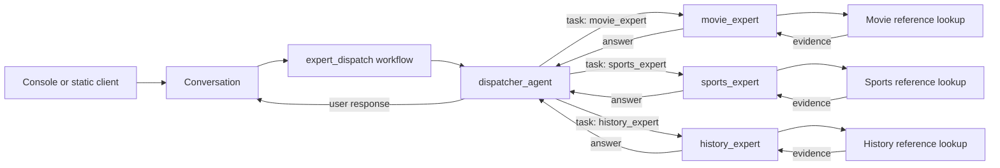

<!-- Copyright (c) 2026 Martin.Bechard@DevConsult.ca; third-party source excerpts retain their original rights. -->
# How chat clients, agents, and recording fit together

The local-report and Langfuse applications use the same `chat_agent` and the same
conversation loop. A client supplies user requests; the agent receives messages;
a recording wrapper observes the execution. Changing the recording backend does
not require another agent definition or another implementation of chat history.

## Responsibilities



| Part | Owns | Does not own |
| --- | --- | --- |
| Workflow | Participant selection and connections | Prompts, client input, tracing |
| Agent | System instructions and graph construction | User prompts, terminal input, tracing backend |
| Client | Producing each request and consuming each result | Agent history or provider configuration |
| Conversation | History, turn numbering, invocation, interrupt boundary | Langfuse imports, test prompts, export format |
| Test case | Scenario prompts and scripted assistant answers | Generic client behavior |
| Local recorder | Trace callback, saved run/prices, HTML | Conversation loop |
| Langfuse runtime | Client lifecycle, root trace, turn observations, callback, flush | Agent definition or duplicate conversation loop |

Shared code is in `src/lg_report/platform`, workflow composition in `workflows`, agent definitions in `agents`, custom
tools in `tools`, and local reporting in `report`. Simple chat has no custom tool.
The Langfuse sample imports the same agent factory as the local sample.

## One Langfuse session

```mermaid
sequenceDiagram
  participant U as Console or static client
  participant C as Conversation
  participant L as Langfuse recording
  participant A as chat_agent graph
  participant M as Model
  L->>L: Open session trace (private unless explicitly published)
  L->>C: invoke with official callback and turn-scope hook
  loop Until client finishes or agent pauses
    C->>U: receive()
    U-->>C: Request(prompt, text attachments)
    C->>L: Enter turn scope(number, request)
    L->>L: Open Turn N observation
    C->>A: Invoke with full history + new user message
    A->>M: Model request
    M-->>A: Model response
    Note over A,L: Official callback captures nested graph/model/tool observations
    A-->>C: Result including messages
    C->>L: Complete turn with result
    L->>L: Close Turn N observation
    C->>U: respond(result)
    Note over C: Retain full history; stop if result contains an interrupt
  end
  C-->>L: Last result, or None if no requests
  L->>L: Close root, flush observations, shut down SDK
```

`Conversation` accepts an optional turn-scope hook. The hook is a context manager:
it receives the turn number and Request, and yields a completion function accepting
the result. Langfuse opens a turn observation on entry, records output on completion,
and closes it on exit. Exceptions leave through the context manager so failed turns
and the root trace are marked as errors. Without a hook, the local-report application
uses the same loop with a no-op scope.

Client input is collected before opening a turn observation, so time spent typing
does not inflate the model turn duration. The root spans the complete session,
including user waiting time. The callback is attached once and inherited by nested
operations. Adding another callback to the agent would duplicate observations.

## Files, visibility, and failures

Console `/attach PATH` reads UTF-8 text locally. Filename and content enter the
next user message, remain in conversation history, and are sent to the configured
model and Langfuse endpoint. PDF/image decoding is not implemented. No filesystem
access is granted to the agent by attaching text.

Langfuse traces are private by default. `--public-trace` explicitly publishes the
trace, including submitted content, for viewing without a trace-viewer login where
the server permits it. This flag does not disable API authentication. Offline
model execution still sends real traces to Langfuse; it only avoids LLM calls.

Missing tracing configuration or failed authentication stops before graph creation.
Graph failures propagate out of the session, close observations, and trigger SDK
shutdown. An approval interrupt ends the client loop and marks the session as
interrupted; this sample does not implement approval/resume. An empty session is
marked incomplete instead of indexing a nonexistent final answer. Flush completes
SDK export work but does not guarantee that the server has indexed the trace yet.

## Scope and verification

All samples now use this composition. Single-agent workflows are explicit so
adding a participant does not change clients or reporting. The local and Langfuse
subagent applications share one workflow and one test case. Obsolete simulation
modules, sample-owned tool files, and the prompt-list conversation adapter have
been removed rather than retained as alternate routes.

Tests use the real official callback with an in-memory exporter to verify one root,
turn ancestry, exactly one observation per model call, retained history, attachments,
private/public selection, interrupts, empty sessions, and errors. A separate local
server smoke run verifies ingestion without making paid model calls.

## Domain dispatcher



The workflow compiles the three leaf agents, then supplies them to the dispatcher.
The dispatcher uses DeepAgents' SubAgentMiddleware directly on a LangChain agent
(a LangGraph graph), exposing exactly one task tool and exactly three experts.
This avoids the default general-purpose delegate and filesystem tools of a full
DeepAgents harness. Each expert receives the self-contained assignment, and the
parent receives its final answer. No question keywords are routed in Python.

Live routing is a model decision based on the expert descriptions. Ambiguous
questions should trigger clarification; unsupported domains should receive a scope
explanation. These are behavioral instructions, not a deterministic classifier.
Offline fixtures author the expected decisions and verify graph execution and
accounting. They do not establish live classification accuracy.

The compiled-agent message contract follows the
[DeepAgents CompiledSubAgent API](https://reference.langchain.com/python/deepagents/middleware/subagents/CompiledSubAgent).

The expert-dispatch workflow takes one model argument and shares that exact LLM
object among all four agents. Their graphs retain separate message histories. Expert specialization comes
from domain instructions and separate retrieval tools, not different LLM weights.
The tools return source-labelled passages from small local reference collections;
they perform phrase matching, with explicit misses, rather than vector search.
An expert first requests evidence and then consumes it in another LLM request.
The report counts both calls and the parent calls. A future RAG service can replace
the local retrieval implementation without changing the workflow/client boundary.

## Explicit review loop

The [review-loop lesson](../samples/review_loop/README.md) uses a `StateGraph`
with author and judge nodes sharing one LLM. A conditional edge sends a rejected
draft back to the author with the actual judge feedback. The workflow owns the
round limit and validates verdicts; instructions cannot bypass those edges.
Separate internal histories preserve each role's prior work and token accounting,
while the client receives only the final approved answer or explicitly unapproved
draft. The sample intentionally requests a high-level first draft to demonstrate
an evidence-based drill-down on revision.
