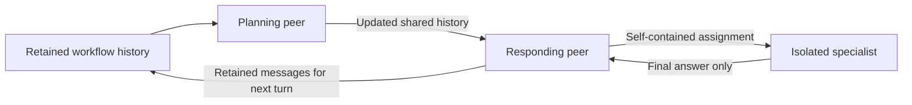
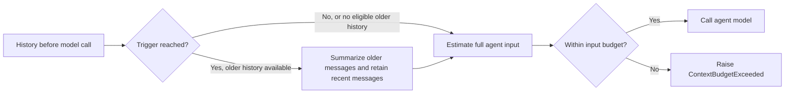
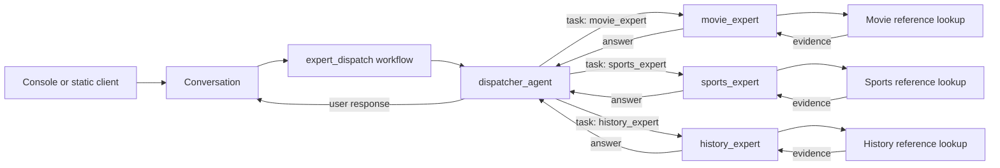

<!-- Copyright (c) 2026 Martin.Bechard@DevConsult.ca -->
# Client, driver, workflow, and agent composition

See the [unified execution design](unified-execution-design.html) for component
responsibilities, interaction sequences, and diagrams for all sample applications.

## Sample discovery and input sources

`python -m agent_runtime --list` discovers `samples/*/sample.json`. Each entry
provides an ID, short name, explanation, workflow entry point, script module,
and optional workflow settings or tracing mode. There is no central sample list
and no per-sample Python launcher. Restart the CLI/server after adding metadata.

Within the harness, `argument_parser.py` defines and validates launch options,
`settings.py` prepares shared configuration, workflow options, and initial prompts.
`__main__.py` delegates to `harness/app.py`. Its `main()` explicitly selects
`ConsoleApplication` for every non-web launch, or `AngularApplication` for web
startup. `AngularApplication.run()` prepares the selected sample and starts the
HTTP listener.
`ConsoleApplication.run_session()` prepares both interactive and static runs; no nested
callback owns its launch policy. `execute_conversation()` executes one prepared
Python-client conversation.

Web startup uses the same preparation, but its execution lifetime is different:
HTTP session creation constructs a graph, and `WebConversation` records each run,
saves context evidence, and releases resources when the session closes. These
responsibilities remain active for web chat; they are not skipped when the server
starts.

`SampleCatalog` belongs to the Python harness. Both the shared console and HTTP
handlers use it to list samples and construct fresh workflows. The catalog
establishes a model factory scope; workflows call `build_model(caller="workflow")`
and an agent that constructs its own model supplies its agent name. Live mode
reads provider settings; scripted mode resolves only that caller's responses.
Specialized scripts can implement `build_models(options)` for tool-dependent
answers or context-accounting fixtures. Scripts stay outside workflow/agent code.

Prompt sequencing belongs to a client, with one cursor per conversation:

- Python `ScriptPrompter` yields authored requests inside `ConsoleClient`. The
  client displays responses and handles interruption answers independently.
  Full result capture for assertions belongs to `tests/fixtures/mock_client.py`.
- TypeScript `WebScriptPrompter` holds prompts received in catalog metadata. The
  browser submits the current prompt through `HttpAgent`, advancing only after
  the turn completes. Approval/clarification resumes do not consume another prompt.
- `ConsoleClient` reads human input and, when given a catalog, handles `/samples`,
  `/sample ID`, and `/new` between turns; interruption answers pass through unchanged.
  Structured approval/quote lessons use an authored initial request, then return
  to the selection menu after completion. Ordinary console chat requires live mode, selected automatically when the configured provider has an API key. `--demo` selects scripted responses and fixed terminal prompts.

`WebConversation` does not use the Python prompter or own a prompt cursor. It handles
requests arriving over HTTP and retains the graph, checkpoint, and pending
interactions. Switching samples creates fresh models and conversation state,
closes the old session's resources, and resets the browser prompter.

## Shared execution

`SampleCatalog.create_run()` constructs workflows and models for both interfaces.
`harness/workflow_lifecycle.py` provides `configure_context_audit()`,
`save_context_audit()`, and `close_run()`. Console conversations configure once,
save when finished, and close immediately; web sessions configure once, save after
each run/resume, and close when the session ends or expires.

`reporting.recording.save_report()` exports the shared local bundle from closed
trace evidence. `execute_runnable()` calls it after a console conversation;
`WebConversation` calls it in a private directory before publishing a completed
HTTP run's report. `execute_conversation()` owns a single console launch sequence;
Langfuse adds a callback and conversation/turn observation scopes, without a
separate execution or reporting path. It also retains this local bundle. Terminal
printing and the client prompt loop remain separate from HTTP event streaming.

Every sample client submits AG-UI run/resume requests to `LangGraphAgent`.
Console and scripted clients consume its Python event stream in-process; Angular
uses `HttpAgent` over HTTP/SSE. LangGraph executes the nodes and retains state in
a checkpoint. AG-UI is the protocol for all clients, not just the browser.

```text
Console / scripted → Conversation (client event pump) ──┐
                                                      ├→ LangGraphAgent → workflow → agents/tools
Angular → HttpAgent → HTTP/SSE endpoint ────────────────┘
                          callbacks → local recorder / selected Langfuse recorder
```

`harness/execution.py` constructs the driver and scopes resources such as MCP.
It requires a caller-supplied or graph-attached checkpointer and raises
`ValueError` if neither is present; the conversation owns persistence across runs.
The `file_approval` and `quote_request` factories accept an optional `checkpointer`
but never create one. Direct callers supply it for pause/resume; conversation
entry points attach their own retained saver before execution.
It does not implement an execution loop. `Conversation` obtains requests and
interaction answers from clients, submits native AG-UI inputs, and consumes
native events. It never invokes a graph directly or reconstructs model history.
`harness/web_conversation.py` provides `WebConversation`, which retains the
workflow, checkpoint, pending interrupts, and run status and surrounds the same
driver with recording. The web server owns HTTP validation and session
registration. Agents contain no terminal or browser code.

## Responsibilities

| Component | Owns |
| --- | --- |
| Client | Request input, attachments, presentation, responses to approval/questions |
| LangGraphAgent | Driving runs/resumes and translating execution into AG-UI events |
| Checkpointer | Conversation and workflow state across runs |
| Workflow | Participants, routing, limits, approval and context policies |
| Agent | Instructions, tools, model decisions, protocol validation, domain semantics |
| Recorder | Callbacks, accounting, capture policy, reporting and selected trace delivery |

## Agent encapsulation and workflow harnesses

An agent's internal model/tool loop and a workflow's outer control flow are
different responsibilities, even though both may use LangGraph. An agent decides
how to perform its task. The harness controls when it runs, what prior context is
offered, which result triggers another step, and when to pause or stop.

```text
Application: model configuration + client + reporting
                         |
                  Workflow harness
            participants / context / limits / pauses
                         |
                 Agent public contract
                  task data -> result
                         |
               Encapsulated agent internals
          prompt / tools / model calls / protocol parsing
```

The review agents accept `AuthorRequest` and `JudgeRequest` and return candidate
or validated review data with role histories. The quote interpreter accepts
`QuoteAssessment` and returns a validated `QuoteDecision`; its workflow cannot
complete from malformed tool-call output because parsing fails inside the agent
before a decision reaches routing. Checkpointing and human interrupts remain in
the quote workflow, so resuming an ask does not repeat its preceding model call.

The claims agent owns its private store and domain-specific retention knowledge.
Its harness compares `context_version` and chooses whether to apply
`retain_unaffected_context`. The harness never names a claim/policy tool or reads
the store. The agent has no context-mode flag and makes all retrieval decisions.

This separation does not require an extra wrapper around every compiled agent.
The direct chat, tool chat, RAG, and expert agents already expose a suitable
message-state interface. A wrapper is useful when a role needs to hide another
protocol, such as a quote decision schema or domain-specific state invalidation.

### Workflow audit

| Workflow | Agent-owned details | Harness-owned controls |
| --- | --- | --- |
| `simple_chat` | Chat instructions and graph | Participant selection; shared conversation retains history |
| `tool_chat` | Echo instructions, tool, and model/tool loop | Participant selection; no pre-executed tool call |
| `rag_chat` | Index access, search tool, evidence instructions | Participant selection; no preloaded passages |
| `mcp_rag_chat` | Transport/discovery and tools inside `open_agent` | Synchronous bridge and per-turn async context lifetime |
| `thinking_agent` | Evidence/test tools and investigation decisions | Participant selection; no scripted live routing |
| `subagent_chat` | Parent delegation policy and specialist instructions/tools | Parent/child composition using the specialist's public specification |
| `expert_dispatch` | Expert capabilities, role prompts, retrieval, dispatcher policy | Register selected participants; share the configured model |
| `review_loop` | Author/judge framing and judge protocol validation | Separate histories, round budget, revision edges, final outcome |
| `quote_request` | Interpretation, message formatting, decision binding/validation | Human answers, cancellation, reassessment routing |
| `file_approval` | Editing prompt, file-tool registration, model/tool loop | Restricted-tool policy, automatic approval interrupts, cancellation |
| `claims_context` | Instructions, tools, store, context-dependency knowledge | Naive/managed strategy, turn loop, retained working history and audit |

Tests exercise review/quote agents directly, independently of their workflows,
and retain workflow coverage for revision limits, invalid decisions, cancellation,
and resume. Scripted checks establish execution and context behavior, not live
reasoning quality.

The file editor uses DeepAgent’s native filesystem tools.
`src/agent_runtime/backends/file_access_backend.py` restricts reads to the source and
target and mutations to the target, delegating operations to FilesystemBackend.
The workflow supplies approval and stale-target middleware for both `write_file`
and `edit_file`; the backend never requests approval.

The shell-script lesson uses `agents/shell_agent.py` with `backends/shell_backend.py`.
`ShellBackend` implements `SandboxBackendProtocol`, enabling DeepAgent’s native
`execute` tool, and reuses `FilesystemBackend` for file operations. Commands run
locally in a prepared working directory; this does not provide OS isolation.

## Workflow execution parameters

Workflows select the model, backend, middleware, and graph-boundary checkpointer
and pass them to agent builders in a plain dictionary. Builders unpack it with
`**parameters` into the native constructor and add their prompts and domain tools.
DeepAgents agents retain the library defaults. Focused LangChain agents receive
only their configured tools and middleware; backend instances are supplied through
DeepAgents middleware such as `FilesystemMiddleware`. The author, judge, and quote
roles use this standard LangChain agent loop, so supplied middleware runs there too.

The three reference experts share `agents/reference_expert.py`. Their distinct
role definitions preserve prompts, domain tool isolation, and report identities.
The dispatcher receives delegation middleware configured by its workflow.
`tests/test_workflow_wiring.py` verifies these dependency boundaries.

## Context management

An agent's **context** is the input supplied to one model call. It includes role
instructions, retained conversation messages, and available tool definitions.
The workflow chooses which messages each agent receives and how long it retains
them. Sharing a model object does not share conversation history.

### Shared, isolated, and inherited histories

Agent relationships do not automatically determine context sharing. The
workflow's state and message handoffs determine what each agent can see.

| Arrangement | Messages available to the agent | Effect on other agents |
| --- | --- | --- |
| Peers with shared history | The workflow's accumulated messages, including earlier peer outputs and any retained summary | Later peers receive updates to that shared history. |
| Peers with separate histories | Messages explicitly selected for each peer, such as a task and a previous result | Running sequentially does not merge their histories. |
| Isolated subagent: `mode="isolated"` | Its delegated assignment, followed by its own messages and tool observations | Its final answer returns through `task`; its internal transcript stays separate. |
| Forked subagent: `mode="fork"` | The parent's effective conversation at delegation, followed by the child's own work | The child continues separately; forking does not create one live shared transcript. |

An isolated child uses its own role instructions. For declarative forked
subagents, DeepAgents appends child instructions to the inherited parent prompt.
Fork mode is experimental in the installed DeepAgents 0.7.15 API. No current
sample selects fork mode. Conversation isolation does not itself isolate shared
files, backends, or other permitted workflow state.

The [context-budget sample](../samples/context_budget/README.md) explicitly shares
history between its planning and responding peers. Its specialist is isolated.
The [review loop](../samples/review_loop/README.md) instead retains separate
author and judge histories. Both arrangements can use the same provider model.



### Summarization: trigger and keep

Summarization replaces older conversation messages with a shorter summary.
It reduces the history supplied to subsequent model calls while preserving
recent messages. A summary can lose details; it is not a verbatim archive.

The sample's `ContextBudget` maps its settings to LangChain's
`SummarizationMiddleware`:

| Budget setting | Middleware option | Meaning |
| --- | --- | --- |
| `trigger_tokens` | `trigger=("tokens", value)` | Start summarization when the estimated history size reaches this threshold and an older portion can be summarized. |
| `keep_tokens` | `keep=("tokens", value)` | Target how much recent history remains unsummarized. Complete messages and tool call/result pairs can exceed this target. |
| `max_input_tokens` | Separate input-budget guard | Reject an agent call when the final estimated input still exceeds this ceiling after compaction. Includes instructions and tool schemas. |

For example, `trigger=("tokens", 16000)` and `keep=("tokens", 4000)` request
summarization at about 16,000 history tokens while retaining about 4,000 recent
tokens. Subsequent input contains **the summary plus retained messages**, as
well as role instructions and tool definitions. It is not capped at 4,000 tokens.



The threshold and ceiling serve different purposes. A large latest message or
an indivisible tool exchange can remain too large after summarization. The
guard rejects that request instead of silently truncating user input.

These settings use local token estimates, not a provider-exact tokenizer.
They do not change the model's physical context capacity. Input budgets must
leave room for generated output; `LG_MAX_TOKENS` controls output allowance.
Summarization also invokes a model and contributes to usage and cost. Those
summary requests have their own provider limits; the agent input guard does
not cap summary-model requests.

### Workflow and subagent configuration

The workflow configures one budget for its shared peer history and another for
its isolated specialist. The sample uses small values to demonstrate compaction:

| Context | Input ceiling | Summarization trigger | Recent-history target |
| --- | ---: | ---: | ---: |
| Shared workflow history | 4,000 | 500 | 120 |
| Isolated specialist history | 2,000 | 180 | 60 |

Both peers receive fresh middleware instances configured with the workflow
budget. After each peer runs, the workflow replaces its retained message list
with that peer's result. This preserves deletions made by summarization across
peer boundaries and later checkpointed turns.

The specialist's middleware is registered on its **subagent specification**:

```python
specialist = workflow_specialist.build_agent(
    {
        "model": specialist_model,
        "middleware": subagent_budget.middleware(subagent_summary_model),
    }
)
specialist["mode"] = "isolated"
delegation = SubAgentMiddleware(backend=StateBackend(), subagents=[specialist])
```

The specialist factory places the supplied middleware in its specification's
`middleware` list. The native `task` tool invokes the child with that policy.
Its model-generated arguments select a specialist and provide an assignment;
they do not override the configured budget.

Implementation and verification are located here:

```text
src/agent_runtime/
  context_budget.py             # Compaction policy and estimated input guard
  workflows/context_budget.py   # Shared history, budgets, and child registration
  agents/workflow_specialist.py # Child instructions, tool, and middleware specification
tests/
  test_context_budget.py        # Actual model inputs, isolation, and budget checks
```

See the [policy implementation](../src/agent_runtime/context_budget.py),
[workflow wiring](../src/agent_runtime/workflows/context_budget.py), and
[context tests](../tests/test_context_budget.py) for the executable contracts.
Tests cover independent thresholds and retained history in synchronous and
asynchronous execution. The sample scripts model decisions and summary text;
it verifies middleware mechanics, not live summarization quality.

## Human interactions

A completed run may be waiting for input. Its interrupted outcome includes the
interrupt ID and the workflow payload in `metadata.langgraph.raw`. An approval
payload names the action and arguments; a question payload contains the question
and explanation. The client submits a resolved resume entry with the answer in
`payload`, the same thread ID, and a new run ID. It does not append another user
request. Workflow cancellation is an explicit payload such as `cancel` or
`/cancel`; aborting a stream is a separate operation without rollback.

The browser validates pending interrupt IDs and rejects a new user turn until
all pending interactions are answered. Invalid decisions remain subject to the
workflow's validation. Scripted clients require explicit response fixtures and
never autoapprove by default. LangGraph may replay the interrupted node, so
approval code contains no writes before the pause.

## Reports and session lifetime

`WebConversation` attaches `TraceCapture` to the shared driver and optionally
adds the callback from `LangfuseCapture`, whose scope groups browser runs.
`TraceCapture` lives in `harness/trace_capture.py` and writes `spans.jsonl`; normalization and rendering produce
`run.json`, `prices.json`, and `report.html`. Local capture remains active when
Langfuse is selected. There is no `CSVRecording` class.

Local console reports cover a conversation. Browser reports cover each run,
including interrupted runs, and include thread identity in trace context.
All clients use the shared launcher's content-capture setting: content is
captured by default; `--metadata-only` omits it from saved reports. Unknown
usage or pricing remains unknown. Ordinary browser samples disable ambient
LangSmith tracing; selecting a Langfuse sample explicitly adds its recorder.

Langfuse console sessions retain their existing root/turn observations. Browser
Langfuse runs share a deterministic trace identity derived from the session and
retain nested agent callbacks. Configuration/authentication errors prevent
execution. SDK ingestion is external; in-memory tests prove callback behavior,
not remote delivery. Session deletion, expiry, and server shutdown release
browser recording resources and temporary file workspaces.

## Verification

`tests/test_web_chat.py` exercises every catalog selection through console and
HTTP/SSE, including approval and clarification resumes. Claims context tests
inspect actual model inputs as well as final store state. Browser acceptance
tests check interaction controls, attachments, streaming, delegation, and Stop.
Langfuse SDK tests use an in-memory exporter. These are deterministic mechanics
checks, not live-model accuracy or hosted-ingestion claims.

## Domain dispatcher



The workflow compiles the three leaf agents, then supplies them to the dispatcher.
The dispatcher uses DeepAgents' SubAgentMiddleware directly on a LangChain agent
(a LangGraph graph), exposing exactly one task tool and exactly three experts.
This avoids the default general-purpose delegate and filesystem tools of a full
DeepAgents harness. Each expert receives the self-contained assignment, and the
parent receives its final answer. No question keywords are routed in Python.

Live routing is a model decision based on the expert descriptions. Ambiguous
questions should trigger clarification; unsupported domains should receive a scope
explanation. These are behavioral instructions, not a deterministic classifier.
Offline fixtures author the expected decisions and verify graph execution and
accounting. They do not establish live classification accuracy.

The compiled-agent message contract follows the
[DeepAgents CompiledSubAgent API](https://reference.langchain.com/python/deepagents/middleware/subagents/CompiledSubAgent).

The expert-dispatch workflow takes one model argument and shares that exact LLM
object among all four agents. Their graphs retain separate message histories. Expert specialization comes
from domain instructions and separate retrieval tools, not different LLM weights.
The tools return source-labelled passages from small local reference collections;
they perform phrase matching, with explicit misses, rather than vector search.
An expert first requests evidence and then consumes it in another LLM request.
The report counts both calls and the parent calls. A future RAG service can replace
the local retrieval implementation without changing the workflow/client boundary.

## Explicit review loop

The [review-loop lesson](../samples/review_loop/README.md) uses a `StateGraph`
with author and judge nodes sharing one LLM. A conditional edge sends a rejected
draft back to the author with the actual judge feedback. The workflow owns the
round limit and routes on validated verdicts; instructions cannot bypass those
edges. The author owns draft/revision message templates; the judge owns evidence
framing, its rubric, and parsing/validation of model JSON. Workflow nodes pass
structured task data and retain returned role histories without assembling model
prompts or interpreting the provider's output protocol.
Separate internal histories preserve each role's prior work and token accounting,
while the client receives only the final approved answer or explicitly unapproved
draft. The sample intentionally requests a high-level first draft to demonstrate
an evidence-based drill-down on revision.
