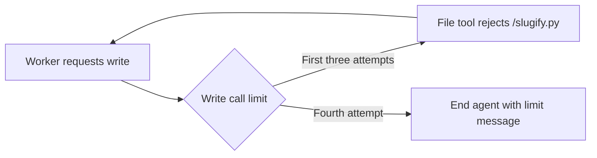

<!-- Copyright (c) 2026 Martin.Bechard@DevConsult.ca -->
# Circuit breaker: repeated filename failure

This sample deliberately reproduces the filename bug from the context-budget
exercise. The assignment requires `/slugify.py`, but the shared exercise backend
only permits `/plan.md`, `/slug.py`, and `/test_slug.py`. The worker repeatedly
requests the same forbidden write. No file is created.



`ToolCallLimitMiddleware(tool_name="write_file", run_limit=3,
exit_behavior="end")` stops execution before the fourth write. It supplies the
matching error tool message and a final limit message without another model
call. `ModelCallLimitMiddleware(run_limit=6, exit_behavior="end")` provides an
additional ceiling. Both are native LangChain middleware used with DeepAgents
file tools. Counters reset per invocation and live outside conversation text.

This is a **call-count breaker**, not a detector of identical errors: successful
writes would consume the same allowance. The deliberately faulty model decisions
make repeated failure visible. There is no automatic retry of the stopped run.
The report's successful execution status means the demonstration ended normally;
the requested implementation remains blocked, as its final message and rejected
tool results show. A real workflow could route that blocked outcome to a planner.

Run the deterministic demonstration from the repository root:

```sh
uv run python -m agent_runtime --sample circuit_breaker --demo --prices models.json --out reports/circuit_breaker
```

Open the [saved report](../../reports/circuit_breaker/report.html). Expect four
model calls, three executed file tools, and a fourth tool request in the
Conversation section. The Workflow result shows the native limit message;
the blocked request has no executed-tool span. Only decisions are simulated; file restrictions and the
breaker execute normally. Live mode is available with `--live --env-file
.env.local`, but a real model may stop voluntarily before reaching the limit.

The [workflow](../../src/agent_runtime/workflows/circuit_breaker.py) owns limits
and the intentionally defective instructions. The [script](sample.py)
owns deterministic decisions. The [context-budget sample](../context_budget/README.md)
uses the correct `/slug.py` and `/test_slug.py` names.
