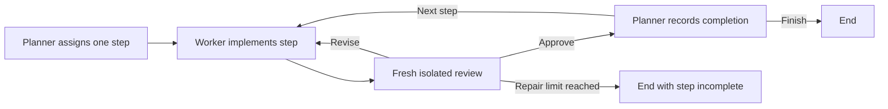

<!-- Copyright (c) 2026 Martin.Bechard@DevConsult.ca -->
# Context budgets: a file-backed coding plan

This sample coordinates one plan step at a time. The **planner** writes `/plan.md` and assigns a task ID with acceptance criteria. The **worker** implements only that step. A fresh **isolated-reviewer** inspects the current files and returns `approve` or `revise`. A rejection returns the same task to the worker. Only approval reaches the planner's completion update; the planner rereads the plan and selects the next task or finishes.



This documentation diagram summarizes the code. The report state diagram is extracted from the compiled graph; actual model responses select its conditional routes. The scripted run deliberately presents a T1 implementation without boundary trimming, receives a rejection, repairs it, and obtains approval before recording completion. It then completes T2 (tests). The second user turn adds and completes T3 (boundary tests). Each completion has its own preceding independent approval.

The sample bundles two self-contained skills: [coding practices](skills/coding-practices/SKILL.md) for the planner and worker, and [review practices](skills/review-practices/SKILL.md) for the reviewer. They are loaded from this sample at construction time. They need no shared machine skill, MCP server, external package, or network service. The plan plus these skills and repeated reads create meaningful context pressure. The plan remains on disk even when middleware summarizes conversation history.

## Context and compaction

The planner and worker each have a fresh instance of the same budget policy. Their retained messages are published back to the outer workflow after every role, so compaction cannot resurrect older messages. Each reviewer task starts with a new isolated context, so the reviewer does not use compaction middleware. Only its validated final assessment enters shared history. Current task, review verdict, and attempt count also live in graph state outside the compacted history. Native dynamic-prompt middleware supplies these authoritative facts in the system instructions on every model call, including calls after compaction. Worker write permission is narrowed to the files in the current planner assignment. A summary cannot substitute for approval. Shared-history summary calls are named `context_summarizer` in the report.

| History | Trigger | Recent-history target | Final input ceiling |
| --- | ---: | ---: | ---: |
| Main context, shared by planner and worker | 8,500 tokens | 900 tokens | 18,000 tokens |

The scripted two-turn run produces two compactions at this threshold. The trigger is checked before a model call. When reached, LangChain's `SummarizationMiddleware` replaces older messages with a summary while preserving recent messages and complete tool exchanges. The target is approximate: one large message may exceed it. A separate input guard rejects a request whose full estimated input still exceeds the ceiling. The guard includes role instructions and tool schemas. Compaction is a successful history replacement, not a billed model category; the summary model's own call is billed normally.

The context estimate uses reported total input plus estimated output retained for the next request. Fresh and cache-read input are constituents of that input total. Reasoning counts only when a reasoning item is retained. A new user or tool message is estimated locally until a provider receipt arrives. A history rewrite invalidates the older receipt, so the next estimate uses the current messages. This is a useful budget signal, not the provider's exact tokenizer or capacity.

## Run and inspect

From the repository root:

```sh
uv run python -m agent_runtime --sample context_budget --prices models.json --demo
```

Open the saved [HTML report](../../reports/context_budget/report.html). The two-turn offline run uses deterministic model decisions but real file tools, isolated reviewer invocations, checkpointing, and compaction. Inspect the Conversation section to see the plan write, each status edit and reread, the reviewer's file reads, and the returned report. Orange compaction events appear in the collaboration diagram, execution and conversation tables, and as thin lines in the LLM cost chart. The chart can show raw Post-call Context tokens or context as a percentage of model capacity.

To keep the exercise files after a run, supply a workspace directory:

```sh
uv run python -m agent_runtime --sample context_budget --prices models.json --demo --out reports/context_budget --option 'workspace_dir="reports/context_budget/workspace"'
```

Without that option, the launcher uses a temporary workspace and removes it when the run closes. Only `/plan.md`, `/slug.py`, and `/test_slug.py` are exposed to the agents. The reviewer receives only `read_file`; the planner and worker receive `read_file`, `write_file`, and `edit_file`, with backend write permissions restricted to `/plan.md` for the planner and the two Python files for the worker.

The public function is `slugify`, in module `slug`; tests use `from slug import slugify`.
The planner is explicitly given these filenames and the absence of a command tool.
The separate [circuit-breaker sample](../circuit_breaker/README.md) deliberately
uses the forbidden `/slugify.py` name to demonstrate bounded repeated failure.

The scripted agents write tests but have no command tool, so their statements do **not** claim those tests executed. You can run the saved tests yourself with `python -m unittest discover -s reports/context_budget/workspace -p 'test_*.py'` after an explicit-workspace run. The offline token usage is illustrative and assumes no cache reuse after rewritten context. Live mode uses configured models and its actual decisions and compaction count can vary:

```sh
uv run python -m agent_runtime --sample context_budget --live --client console --env-file .env.local
```

## Code ownership

- [`workflow`](../../src/agent_runtime/workflows/context_budget.py): shared history, current-task state, response validation, repair limits, and conditional routing.
- [`planner`](../../src/agent_runtime/agents/planner.py) and [`worker`](../../src/agent_runtime/agents/worker.py): role instructions.
- [`isolated reviewer`](../../src/agent_runtime/agents/isolated_reviewer.py): read-only review role.
- [`workspace backend`](../../src/agent_runtime/workflows/exercise_backend.py): the three allowed virtual file paths.
- [`scripted run`](sample.py): reproducible model decisions and the substantial example plan.
- [`context budget`](../../src/agent_runtime/context_budget.py): reusable compaction policy and final input guard.

Verify the workflow and report with:

```sh
uv run pytest -q tests/test_context_budget.py tests/test_samples.py -k 'context_budget or budget'
```

The default repair limit is three worker attempts per step. A final rejection ends with the step incomplete. Invalid JSON or a verdict for a different task fails visibly. Tests inspect actual responses to verify assignment, repair, approval, and completion order in synchronous and asynchronous runs.
