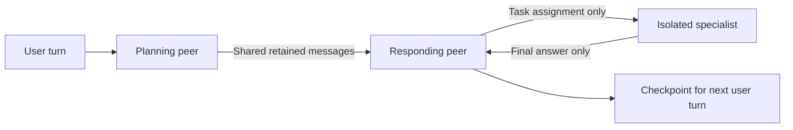

<!-- Copyright (c) 2026 Martin.Bechard@DevConsult.ca -->
# Workflow and subagent context budgets

This sample runs a planning peer followed by a responding peer over **one shared
message history**. The responder delegates through DeepAgents' native `task`
tool to an **isolated specialist**, which has its own history and context budget.
The workflow owns these policies; agent modules own instructions and tools.

See [context management](../../docs/chat-composition.md#context-management) for
the shared, isolated, and forked context rules and the meaning of `trigger` and
`keep` across the project.



## Why these roles exist

- Planner and responder demonstrate a handoff over shared history.
- The specialist demonstrates an isolated task: assignment in, final answer out.
- Summarizers are supporting model calls that rewrite history, not peer agents.

```text
Shared history: user -> planner -> responder -> next user turn
                                  |      ^
                         assignment      final answer
                                  v      |
Isolated task:                specialist

Context estimate >= 1,500 tokens -> summarize older messages
Full agent input > 4,000 estimated tokens -> error before agent model call
Isolated task: trigger 1,200; full-input error limit 2,000
```

The plot and compaction trigger use **reported input + output** as the baseline.
Input includes cache, instructions, and tool definitions; output includes reasoning.
New user/tool messages are estimated with characters / 4 plus message overhead.
A fingerprint binds each usage receipt to the history it measured. Compaction or
edits invalidate that receipt; local estimates apply until fresh usage arrives.
This remains an estimate of the next context: peers can change instructions and
tools, and not all billed reasoning is retained. The separate full-input error
guard adjusts the same baseline for changes in system instructions and tool
definitions before sending a request. Without valid usage it falls back locally.

## Configuration

Edit the defaults in
[`src/agent_runtime/workflows/context_budget.py`](../../src/agent_runtime/workflows/context_budget.py),
or pass `workflow_budget=` and `subagent_budget=` to `build_workflow`:

```python
workflow_budget = ContextBudget(
    max_input_tokens=4000,
    trigger_tokens=1500,
    keep_tokens=500,
)
subagent_budget = ContextBudget(
    max_input_tokens=2000,
    trigger_tokens=1200,
    keep_tokens=300,
)
```

Compaction runs before the hard limit; the hard limit raises an error if the resulting full request is still too large:

| Setting | Responsibility |
| --- | --- |
| `trigger_tokens` | Summarize when input + output plus estimated new messages reaches this threshold; fall back locally when no valid usage exists. |
| `keep_tokens` | Target amount of recent history to leave unsummarized. Whole messages and tool exchanges remain intact. |
| `max_input_tokens` | Reject an agent request whose final input estimate still exceeds this value after compaction. Includes instructions and tool schemas. |

The retained history contains a summary **plus** recent messages. `keep_tokens`
is not the total resulting size. One oversized message or tool exchange can
exceed the retention target. The guard then rejects excessive input visibly;
it never silently truncates the user's latest request.

These policies estimate context; they are not a provider-exact tokenizer or a change to
the model's physical capacity. Choose input limits below that capacity and
reserve space for generated output. Summary-model requests are separate calls
subject to their provider's limits; the agent input guard does not cap those
requests. The sample observes LangChain's public `SummarizationMiddleware` hooks
with plain agents, avoiding a second default DeepAgents compaction policy.

## Register middleware with the subagent tool

The workflow passes the child's middleware into the specialist specification:

```python
specialist = isolated_subagent.build_agent(
    {
        "model": specialist_model,
        "middleware": subagent_budget.middleware(subagent_summary_model),
    }
)
specialist["mode"] = "isolated"
delegation = SubAgentMiddleware(backend=StateBackend(), subagents=[specialist])
```

`isolated_subagent.build_agent` puts that middleware in the specification's
`middleware` list. The `task` tool invokes the compiled specialist with that
policy. The model's task arguments contain the assignment and specialist name;
they do not choose or override the context budget.

Both peers receive fresh middleware instances using the workflow's one budget.
The workflow replaces its outer message list with each peer's retained history,
so messages removed during compaction cannot reappear at the next peer or turn.
The child returns only its final answer to that shared conversation.

## Run and inspect

From the repository root:

```sh
uv run python -m agent_runtime --sample context_budget --prices models.json --demo
```

Open [`reports/context_budget/report.html`](../../reports/context_budget/report.html).
The offline run has two turns and 15 model calls, including **one shared-history
summary and two child-history summaries**. Summary calls appear in the normal
trace and accounting. Open their requests to see the older messages being
summarized, then inspect the subsequent peer/child model request to see what
was retained. `PARENT_ONLY_DETAIL` and `CHILD_ONLY_DETAIL` identify raw context
that must not cross the isolation boundary; summaries preserve useful meaning.

The report identifies compaction calls as `workflow_history_summarizer` for
shared peer history and `specialist_history_summarizer` for isolated child
history. These are the native summarization middleware's model/retry scopes;
their names describe the work rather than the provider adapter class. The
planner, responder, and delegated specialist retain their own agent identities.

Successful history replacements also appear as orange **Compaction completed**
events on the owning agent's collaboration timeline. Hover or keyboard-focus
an event to see the context estimate and its basis before/after replacement,
the trigger threshold, and separate maximum agent-input limit. The HTML and Excel execution tables include the same evidence.
The evidence labels its counting basis. Before replacement, a valid receipt
includes the previous request envelope. After replacement, its local fallback
is not directly comparable to that provider total. The next plotted point uses
fresh input + output usage. Compaction does not guarantee a smaller result. No-op checks and failed summaries do not emit completion events.
Compactions also appear in the Conversation section after their summaries and
as thin orange vertical markers between requests in the LLM cost chart.
The chart draws one colored line per retained context: planner/responder share
one line, and each isolated task has its own line. Summary requests are gray,
unconnected points. Lines show reported input + output, including cached input
and reasoning output. The short compaction popup shows the trigger estimate,
its basis, the threshold, and the separate input error limit.

The chart defaults to raw input + output tokens with a rounded upper limit and 10%
headroom before rounding. Select **Show context out of 100%** to use the model
capacity percentage scale. Missing capacity does not hide known raw token counts.

The first user prompt repeats background deliberately to reach the threshold.
The child makes two real local echo calls; its first scripted input is
also deliberately long. The tool echoes that input, producing a large
actual tool observation. The second call lets middleware compact an older
complete tool exchange. These are load fixtures, not extra factual evidence.

Summary text and agent decisions are scripted in offline mode. Compaction,
message replacement, checkpointing, and delegation execute for real. Token
counts are illustrative; this sample assumes no cache reuse because history
is rewritten. It does not validate a live model's summary quality.

The shared launcher also supports:

```sh
uv run python -m agent_runtime --sample context_budget --client angular --demo
uv run python -m agent_runtime --sample context_budget --live --client console --env-file .env.local
```

Live mode uses the configured provider for agents and summaries. The actual
number of calls and compactions depends on model decisions and user input.
A summary can lose information; the language constraint in the offline fixture
is an assertion about that fixture, not a guarantee for a live model.

## Code ownership and verification

- `sample.json`: workflow and script metadata for the shared launcher.
- `scripted_run.py`: deterministic prompts, decisions, summaries and simulated usage.
- `workflows/context_budget.py`: shared state, peer order, budgets, child registration.
- `agents/context_planner.py` and `agents/context_responder.py`: peer instructions.
- `agents/isolated_subagent.py`: the existing specialist role and evidence tool.
- `context_budget.py`: reusable compaction settings and final input-size guard.

```sh
uv run pytest -q tests/test_context_budget.py tests/test_samples.py -k 'context_budget or budget'
```

Tests inspect actual model inputs in synchronous and asynchronous runs. They
verify compaction across peer/checkpoint boundaries, isolation, independent
summary calls, and rejection of oversized input before the agent model runs.
