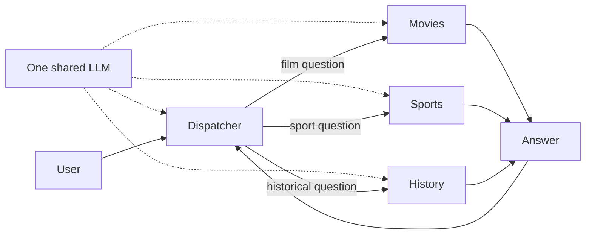

<!-- Copyright (c) 2026 Martin.Bechard@DevConsult.ca; third-party source excerpts retain their original rights. -->
# Expert dispatcher: movies, sports, and history

## Purpose

Learn how one agent chooses the appropriate specialist for a question. The
workflow registers exactly three experts; each lives in its own file and has an
independent conversation context and domain retrieval tool. All roles share the same LLM object. The dispatcher delegates through DeepAgents' real
task tool and uses the returned answer in its response.



## Run

From the repository root:

```sh
uv sync --locked
uv run python -m samples.expert_dispatch.app
```

The default test case asks three questions in one conversation, one per domain.
Expect twelve model requests (dispatcher, expert retrieval request, expert answer,
dispatcher answer per turn), three task executions plus three reference lookups, and one final user-facing answer per turn. The command prints the HTML
path under `reports/expert_dispatch/<run>/` with raw spans, run.json, and prices.json.
Use `--prices models.json --fx-file /path/to/rate.json` for offline reference data.
Pricing and FX can otherwise use their free daily lookups.

## Real questions in the console

```sh
cp samples/expert_dispatch/.env.example samples/expert_dispatch/.env
# Set LG_PROVIDER, LG_MODEL, and the corresponding provider key.
uv run python -m samples.expert_dispatch.app --client console --live
```

Use `User:` to submit questions; `/attach PATH` queues UTF-8 text, `/send` submits
files alone, and `/quit` ends the session. All four agents share one configured LLM object. Live calls are billable. Each expert searches a small local reference collection with source URLs. This
is phrase-based retrieval, not an embedding/vector database or live web search.
Unmatched questions produce an explicit retrieval miss; experts are instructed
to explain the coverage limit.
For the fixed three-question scenario with a provider, use `--live` alone.

## Read the code

- `app.py`: client/model selection and recording wiring.
- `test_case.py`: fixed questions, scripted dispatch decisions, and expert answers.
- `src/lg_report/workflows/expert_dispatch.py`: connects the four roles.
- `src/lg_report/agents/dispatcher_agent.py`: routing instructions and native task tool.
- `src/lg_report/agents/movie_expert.py`, `sports_expert.py`, `history_expert.py`: independent expert definitions.
- Shared `platform` code: console/static clients, history, configuration, simulation.
- `src/lg_report/tools/domain_reference.py`: real local lookups with source-labelled passages and explicit misses.
- Shared `report` code: capture, prices, HTML and Excel export.

The dispatcher model selects by meaning using the registered expert descriptions;
there is no Python keyword classifier. Ambiguous questions should elicit a
clarification, and unrelated questions a supported-domain explanation. Experts
have their own domain-specific reference tool and cannot delegate further. The offline scenario scripts model decisions
but executes the real graphs and task handoffs. It verifies integration, not live
model classification accuracy. Agents and workflows never import this test case.

In the execution tree, each expert must appear beneath its task span. Each
expert starts with its own assignment; previous parent conversation is not copied
wholesale. The parent retains its conversation and expert answers across turns.
Turn costs count all four model requests once, without charging task as another
model call. See [composition and lifecycle diagrams](../../docs/chat-composition.md).

## Verification

```sh
uv run pytest -q tests/test_expert_dispatch.py tests/test_samples.py
```

Tests check all three routes, child ancestry, context isolation, answer return,
exactly three available experts, and reconciled model costs. Live classification
quality requires a separate provider-backed evaluation with varied questions.

## Same model, different expertise

A model is the LLM service used to generate responses. An agent combines that
model with instructions, tools, and its own message context. These experts do not
require three model families: the application uses one provider/model setting
for all roles. The workflow takes one `model` argument. Agent graphs own their separate
conversation histories; the shared offline simulator keeps its test scripts and
context counters isolated by each role's bound tool. Each expert's retrieval result enters its next LLM
request; those extra input/output tokens appear in the report.

The bundled references cover Spirited Away, standard basketball team size, and
the Berlin Wall opening. They are sourced teaching summaries, not comprehensive
knowledge bases. Extend the reference sets or replace the retrieval implementation
with a RAG backend without changing client handling or dispatcher composition.
