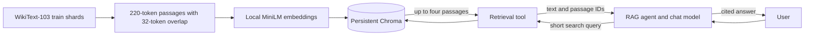

<!-- Copyright (c) 2026 Martin.Bechard@DevConsult.ca; third-party source excerpts retain their original rights. -->
# RAG over WikiText-103 with local Chroma

## Purpose

Answer questions from a corpus too large to include in a prompt. This sample
separates **ingestion** (download, chunk, embed, persist) from **conversation**
(search a few passages, then answer with citations). Chroma runs embedded in the
Python process with persistent disk storage; no Docker service is needed.



## Dataset and scale

[Salesforce WikiText-103](https://huggingface.co/datasets/Salesforce/wikitext) is a
historical Wikipedia-derived corpus with over 100 million benchmark tokens.
The sample downloads both `wikitext-103-raw-v1` training Parquet shards from pinned
revision `b08601e04326c79dfdd32d625aee71d232d685c3`. These are about 300 MiB compressed.
The dataset card lists CC-BY-SA-3.0. Preserve the dataset/source attribution when
redistributing text; the software project's license does not replace content terms.

The default indexes the first **20,000 passages**, not the entire training corpus.
This keeps the laptop exercise manageable while providing millions of input
units—well above a million-token prompt budget. It is a deterministic prefix,
not a representative random sample. Broader topic coverage requires more passages.
`manifest.json` records exact article count, indexed text bytes, tokens with/without
overlap, downloaded Parquet bytes, and database bytes at completion. MiniLM
WordPiece token counts are not OpenAI/Anthropic billing-token counts.

The two raw files are retained for reproducibility and larger future indexes.
They never pass through the chat LLM or the development assistant's context.
Progress logging contains counts, not corpus contents.

## Build the index

```sh
uv sync --locked
uv run python -m samples.rag_chat.ingest
```

Default location: `.cache/lg-report/rag/` (ignored by Git). A pristine default
cache is restored from the compressed snapshot in `data/rag/`, including on the
first chat run. Building a different index extracts the bundled dataset first,
then obtains a small embedding model and tokenizer and embeds locally.
There are no paid embedding requests. Runtime depends on the CPU. Later runs
reuse a complete index. An interrupted run resumes its persisted sequential
prefix; downloaded files are cached. Do not edit an in-progress Chroma collection.

To build a different size, choose a new directory so settings never silently mix:

```sh
uv run python -m samples.rag_chat.ingest --directory .cache/lg-report/rag-larger --max-passages 50000
```

That separate index is for ingestion experiments; using it for this sample
requires changing `WIKIPEDIA_INDEX_DIRECTORY` in the agent file.
The setting is an upper bound; ingestion stops at corpus exhaustion. A completed
manifest is required for chat, so a partially indexed corpus cannot masquerade as
a finished dataset. Chunking uses the embedding model's tokenizer to fit its input
limit; overlapping passages preserve facts crossing chunk boundaries.

## Run the sample

```sh
uv run python -m agent_runtime --sample rag_chat
```

The default uses a scripted chat model but **real semantic retrieval from Chroma**.
Its one question is about how the Australian raven adapts to urban environments. The fixture preselects a source
excerpt, then the graph makes its own recorded search call and returns that excerpt
with a passage ID. This demonstrates the retrieval/cost plumbing, not live answer
quality. It produces a local HTML report with two model calls and one tool call.

For arbitrary user questions:

```sh
cp samples/rag_chat/.env.example samples/rag_chat/.env
# Configure LG_PROVIDER, LG_MODEL and its API key.
uv run python -m agent_runtime --sample rag_chat --client console --live
```

Use `/quit` to finish and write the report. `/attach PATH` includes a UTF-8 file in
user context; it does **not** add it to the vector index. The agent deliberately
uses the fixed `.cache/lg-report/rag/` index; there is no collection setting to
pass through the app or workflow. The standard `--prices`,
`--fx-file`, `--metadata-only`, and `--out` options also apply.

## Responsibilities and teaching points

- `harness/rag_index.py`: pinned dataset acquisition, article reconstruction,
  tokenizer-based chunking, resumable ingestion, manifest and storage checks.
- `tools/semantic_search_wikipedia.py`: bounded semantic search with text, titles, source
  references, and stable passage IDs. It exposes no arbitrary filesystem paths.
- `agents/wikipedia_rag_agent.py`: open the fixed index, create its search tool,
  search before answering, cite passage IDs, abstain when
  evidence is insufficient, treat retrieved text as data rather than instructions.
- `workflows/rag_chat.py`: select the Wikipedia agent and pass only the model.
- This sample: launch wiring, ingestion CLI, static scenario, and configuration.

The chat model sees its instructions, conversation, and at most four retrieved
220-token passages per tool result—not all 20,000 passages. Repeated searches and
turns still accumulate in conversation history; this sample does not implement
context compaction. Chroma always returns nearest candidates, not a guarantee of
relevance, so the agent must judge support and abstain appropriately.

Embeddings use Chroma's local `all-MiniLM-L6-v2` default; ingestion and querying
use the same function. Returned passage text becomes input to the next LLM call
and is included in its token/cost accounting. Local embedding CPU time and database
storage are outside the report's **model-token** cost estimate; do not mistake
that estimate for total infrastructure cost. Live provider usage is retained.

## Verify

```sh
uv run pytest -q tests/test_rag.py
```

Unit/integration tests use tiny real Chroma collections with deterministic test
vectors and require no downloads. They check article boundaries across files,
chunk overlap/length, persistence, source IDs, bounded search, tool execution,
and refusal to use unfinished indexes. The full-size smoke run uses real MiniLM
embeddings and checks semantic retrieval separately. Neither proves live LLM answer
quality without a provider-backed evaluation.

Reference: [Chroma embedding functions](https://docs.trychroma.com/docs/embeddings/embedding-functions).

## Measured example build

The completed 20,000-passage build on 2026-09-18 used:

| Measurement | Value |
| --- | ---: |
| Downloaded training Parquet files | 314,076,578 bytes (314.08 MB / 299.53 MiB) |
| Chroma database files | 233,204,420 bytes (233.20 MB / 222.40 MiB) |
| Indexed articles | 1,045 |
| Passage tokens excluding overlap | 3,691,108 |
| Passage tokens including overlap | 4,297,668 |
| Indexed decoded text including overlap | 20,019,386 bytes |

Sizes above sum logical file bytes; filesystem allocated sizes can be slightly
larger. Embedding model caches live outside the database and are excluded. This
is the indexed prefix, not all 100+ million tokens in the downloaded corpus.
The real-embedding smoke query retrieved four Australian raven passages.
The offline chat report recorded two model requests and one Chroma tool call;
retrieved passages enter the second model request, rather than sending the
millions of indexed units to the chat model. No paid model calls were made.

Local reports default to `report.html`, `run.json`, `spans.jsonl`, and
`prices.json` in `reports/rag_chat/`. The next default run replaces
these files. Use `--out reports/saved-run` to choose another reusable report directory.
