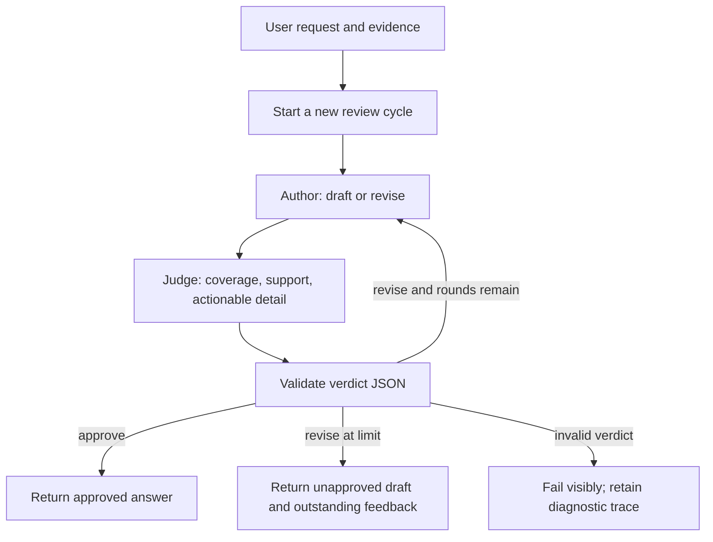

<!-- Copyright (c) 2026 Martin.Bechard@DevConsult.ca; third-party source excerpts retain their original rights. -->
# Review loop: overview, feedback, drill-down

## Purpose

This sample uses an explicit LangGraph `StateGraph` to enforce a review cycle.
One shared LLM serves two agents: an author and an evidence judge. Their system
instructions and message histories differ, but there is only one model object.
The graph owns the edges and maximum number of drafts; the LLM supplies content
and a structured review verdict.



## The test case

The user asks for a concrete fix to a fictional service-latency problem and
supplies four evidence notes. The application deliberately enables
`first_draft_high_level=True`. This asks the author for an honest overview on
round one; it does not ask for false information or force a rejection.

The offline scenario demonstrates:

1. Author: a broad caching/deduplication suggestion.
2. Judge: `revise`, with four specific gaps tied to the request and evidence.
3. Author: a concrete proposal, source-note references, cache lifetime, staged
   rollout, measurable checks, freshness risk, and rollback conditions.
4. Judge: `approve`, with a rationale and no remaining fixes.

Both the judge feedback and the original draft reach the author on revision.
The judge receives the current draft plus original request/evidence. The graph
validates the judge's JSON before routing. Approval is not inferred from wording,
length, or round number. A live judge can approve immediately or reject repeatedly.

## Run

```sh
uv sync --locked
uv run python -m agent_runtime --sample review_loop --demo
```

This prints a new HTML report at `reports/review_loop/report.html` (replacing the previous default run) and saves the
raw spans, normalized run, and price snapshot. Expect four model calls, no tool
calls, and one user turn. The report includes both drafts and both judge responses;
only the final answer is returned to the chat client.

The explicit `--demo` mode makes no provider calls. To avoid model-price network lookups,
supply `--prices models.json`. FX reads the saved shared `exchange-rate.json`.

```sh
cp samples/review_loop/.env.example samples/review_loop/.env
# Configure the provider and API key in that file.
uv run python -m agent_runtime --sample review_loop --live
uv run python -m agent_runtime --sample review_loop --client console --live
```

Console mode supports `/attach PATH` for UTF-8 evidence files, `/send`, and `/quit`.
The same configured LLM object is shared by author and judge. Live calls are
billable; the number of rounds and quality of feedback can differ from fixtures.
Each new user turn resets the review cycle while retaining the user conversation.

## What makes the judge plausible

Its rubric checks coverage of the user's requested topics, support in supplied
evidence, and enough specificity to act on the answer. Risks and verification are
required when the user requests them. A revision verdict must contain actionable
feedback; an approval cannot contain outstanding fixes. Neither longer text nor
having performed a revision is grounds for automatic approval.

This judge cannot independently verify external facts: it has no search tool.
It should flag unsupported claims and distinguish proposals from measurements.
The shared LLM may repeat its own blind spots, so approval is not a guarantee of
truth or a substitute for human review. The incident, metrics, and offline
verdicts are teaching fixtures. Live evaluation quality is not tested by them.

## Code and state

- `sample.py` declares the sample ID and default teaching options alongside user
  evidence and prerecorded author/judge responses. The workflow obtains the
  shared model through `build_model`.
- `src/agent_runtime/workflows/review_loop.py` owns the explicit nodes, conditional
  edge, round counter, and finalization. `max_rounds=3` includes the first draft.
- `src/agent_runtime/agents/review_author.py` owns writing/revision instructions and
  converts structured round inputs into model messages.
- `src/agent_runtime/agents/evidence_judge.py` owns evidence framing, the rubric,
  and parsing/validation of its model response into a review result.
- `src/agent_runtime/harness/simulated_model.py` filters one chronological scenario
  by native agent name, with independent response positions and token accounting.

State keeps `messages` (user conversation), `author_history`, `judge_history`,
`round`, `draft`, `review`, and `outcome`. Role histories grow during revision,
so subsequent input contains the preceding draft or feedback and its tokens.
They are not added wholesale to the user conversation. Agents return these
histories; the workflow retains them without building role-specific prompts.
The harness chooses when to request another draft; the author owns how to express
that request to its model. The judge returns validated review data, so the
workflow's conditional edge does not parse JSON or infer approval from prose.

At the limit, `outcome=limit_reached` and the returned answer explicitly says
**NOT approved**, followed by unresolved feedback. The graph still completed its
execution; this is a content-review outcome, not a provider failure. Invalid JSON,
inconsistent verdicts, or provider failures propagate and can produce diagnostic
reports. There is no human approval pause or durable resume in this sample.

The reusable workflow defaults `first_draft_high_level=False`; the sample enables
it specifically to demonstrate revision. No user prompts are embedded in agents.

## Verify

```sh
uv run pytest -q tests/test_review_loop.py tests/test_samples.py
```

Checks cover feedback propagation, first-round approval, persistent rejection,
malformed verdicts, invalid limits, new-turn reset, separate role contexts, report
content, and model-cost reconciliation. Model calls—not graph nodes—are charged.

## Walk through the code as a lesson

Start at `build_workflow` in `src/agent_runtime/workflows/review_loop.py`. It defines
node functions and connects them; none runs until the client invokes the compiled
graph. The functions close over the same model-backed author and judge runnables.
They do not construct another model on each revision.

Follow the default scenario through these state changes:

| Operation | State it reads | State it updates | Why it exists |
| --- | --- | --- | --- |
| `begin` | User `messages` | Empty role histories, round 0, pending outcome | Start a clean review cycle for this user turn |
| `write`, first visit | User conversation, overview option | Author history, first draft, round 1 | Produce the candidate that needs review |
| `assess`, first visit | Original request/evidence, draft | Judge history, validated `revise` verdict | Identify specific deficiencies |
| `route` | Verdict and round count | No state changes | Select the author edge because revisions remain |
| `write`, second visit | Author history and actual feedback | Revised draft/history, round 2 | Correct the deficiencies without losing the request |
| `assess`, second visit | Revised draft and original evidence | Judge history, validated `approve` verdict | Recheck the candidate against the user's needs |
| `finish` | Latest draft and verdict | One final chat message and approved outcome | Publish the result without another LLM call |

A node returns a partial state update. Because these lists have no append reducer,
the returned history replaces its previous value. The node explicitly constructs
the full new list; combining that with an append reducer would duplicate messages.
`TypedDict` describes state for readers and type checkers; it does not initialize
fields. That is why `begin` is a required node.

The judge's JSON is untrusted model output until `Review.model_validate_json`
accepts it inside the judge agent. That validation checks allowed verdicts, field types, and consistency;
it cannot prove the reasoning is correct. The rubric in `evidence_judge.py` asks
the LLM to make the semantic assessment. These are two different responsibilities.

The report contains four model calls because each of the two drafts gets its own
review. `begin`, `route`, and `finish` do not call a model. Returning a final
`AIMessage` in `finish` packages existing text for the client; it does not generate
new tokens or charge for the answer a second time.

To experiment, change the test case's feedback and revised answer together, then
inspect which feedback enters the next author request. Change `max_rounds` to 1
to see a rejected first draft returned with its unresolved concerns. Turn off
`first_draft_high_level` for normal author behavior; a live judge still decides
whether the resulting answer meets the request.
